# YEE-104

<h1 align="center"> YEE-104 초딩도 할 수 있는 머신러닝 </h1>

 

> Welcome to the YEE-104 repository! We aim to study Stanford's EE104 course and make machine learning accessible to everyone.

🚀 YEE-104 초딩도 할 수 있는 머신러닝 — 가짜연구소 11기 스터디 프로젝트
 “함께 만드는 우연한 혁명(Serendipity Revolution)”
 진실함과 신뢰를 바탕으로 AI/DS 혁신 커뮤니티와 기술 실험을 진행합니다.

## 🌟 프로젝트 목표 (Project Vision)

_"이론에서 실전까지, 함께 성장하는 머신러닝 실험실"_

**YEE-104**는 스탠포드 대학교의 **EE104(Introduction to Machine Learning)** 강의를 'YEE'하게 스터디하는 모임입니다. 데이터 과학과 머신러닝의 이론적 기초를 다루며, 회귀, 분류, 확률적 지도학습, 비지도 학습, 최적화 등 핵심 주제들의 수학적 원리와 이론적 틀을 이해하는 데 중점을 둡니다.

저희는 다음 목표를 가지고 활동합니다.
- **지식 아카이빙**: EE104 강의 내용을 블로그 포스트로 정리하고, 누구나 재현 가능한 오픈 실습 노트북을 제공합니다.
- **역량 전환**: 이론(수학)–코드(구현)–리포트(설명)의 과정을 통해 ‘아는 것’을 ‘할 수 있는 것’으로 전환합니다.
- **지식 선순환 구축**: 스터디–실험–공유의 사이클을 통해 지식의 선순환 구조를 만듭니다.

### 🎯 우리가 세운 가설
> "16주간 **주 1회 발표**와 **주 1편 글**을 작성하면, ML 핵심 개념(일반화, 규제, 최적화)에 대한 **설명 및 구현 능력이 상승할 것이다.**"

## 🧑‍💻 팀 소개 (Team Introduction)

| 역할          | 이름 |  GitHub / Blog                                                                 | 주요 관심 분야                          |
|---------------|------|--------------------------------------------------------------------------------|----------------------------------------|
| **Builder**   | 임진우 | [GitHub](https://github.com/imrealhelper) / [Blog](https://jinwooimblog.vercel.app/) | 항공우주제어시스템, 머신러닝             |
| **Runner(s)** | 권보원 | | |
| **Runner(s)** | 민경주 | | |
| **Runner(s)** | 변정우 | | |
| **Runner(s)** | 윤혁진 | | |
| **Runner(s)** | 이시형 | | |
| **Runner(s)** | 이지유 | | |
| **Runner(s)** | 채서연 | | |
| **Runner(s)** | 최영준 | | |

## 🙋‍♂️ 모집 대상 (Who We're Looking For)

> 💡 **수학으로 머신러닝을 '진짜' 이해하고 싶다면 함께해요!**
> 
> - 머신러닝, 선형대수, 확률과 랜덤 변수 분야에 대한 기본 이해가 필요합니다 (선형대수는 필수, 나머지는 선택).
> - 16주간 꾸준히 참여하며, 피드백과 토의에 열린 태도를 가지신 분을 환영합니다.
> - 머신러닝을 처음 시작하거나, 기초부터 다시 배우고 싶은 분 모두 환영합니다.

## 🚀 프로젝트 로드맵 (Project Roadmap)

```mermaid
gantt
    title YEE-104 스터디 로드맵 (19주)
    dateFormat  x
    axisFormat  %s주차

    section Part 0: 오리엔테이션 (1주)
    Course overview                         : 1, 1

    section Part 1: 예측 모델 기초 (6주)
    Predictors                              : 2, 1
    Validation                              : 3, 1
    Features                                : 4, 1
    Empirical risk minimization             : 5, 1
    Constant predictors                     : 6, 1

    section Part 2: 손실·정칙화·신경망 (3주)
    Non-quadratic losses                    : 7, 1
    Non-quadratic regularizers              : 8, 1
    Neural networks                         : 9, 1

    section Part 3: 분류 (6주)
    Classifiers                             : 10, 1
    ERM for classifiers                     : 11, 1
    Boolean classification                  : 12, 1
    Multi-class classification              : 13, 1
    Probabilistic classification            : 14, 1
    ERM for probabilistic classification    : 15, 1

    section Part 4: 비지도·최적화 (3주)
    Unsupervised learning                   : 16, 1
    Principal components analysis           : 17, 1
    Optimization                            : 18, 1
    Prox-gradient method                    : 19, 1

```

## 🛠️ 학습 활동 및 운영 방식 (How We Learn)

> 💡 **오픈 아카데미 원칙**: 모든 발표자료, 기록, 코드는 GitHub에 공개하며, 누구나 청강, 질문, 피드백에 참여할 수 있습니다.

1.  **진행 및 발표**
    - 실명으로 출석하며, 온라인 참여 시 웹캠 사용을 권장합니다.
    - 발표 순서는 OT에서 결정하며, 인당 최소 2~3회 발표를 목표로 합니다.
    - 모든 슬라이드 및 정리본은 **Notion 페이지**에 공유합니다.

2.  **필수 학습 및 실험 활동**
    - 주차별 발표자는 학습 내용을 **블로그에 요약**하여 공유합니다.
    - 모든 멤버는 스터디 기간 중 **최소 1회 이상 Colab/Notebook 숙제를 제작**합니다.
        - *숙제 예시: [링크](https://colab.research.google.com/drive/1Z1W_z2GK011tXkfHdvksn0aZP_Nz2Jry?usp=sharing) (각자의 도메인 지식과 결합한 재미있는 문제)*
    - 질문 및 어려운 점은 **디스코드에 수시로 공유**하며 함께 해결합니다.

## 📈 성과 지표 (Achievement Metrics)

| 지표                                         | 목표치             |
|----------------------------------------------|--------------------|
| EE104 전 범위 완독률                         | 100%               |
| 주차별 요약 블로그 포스트 발행               | 16편 이상          |
| 개인별 오픈 실습 노트북(숙제) 제작           | 멤버당 1회 이상    |
| ML 핵심 개념 설명/구현 능력 향상 (자가 평가) | 참여자 전원 '상승' |

## 🗓️ 주차별 학습 계획 (Weekly Plan)

| 주차 | 주제/분량 | 발표/실험/리뷰 내용 | 담당자 | 결과물 |
|:---:|:---|:---|:---:|:---|
| **1주** | OT  | 스터디 계획 공유, 선형대수 복습 | 빌더 | Notion 페이지 |
| **2주** | Predictors | 개념 설명 | 빌더 | [Colab](https://colab.research.google.com/drive/1JQVvTYTlIoM_x3_1dOwf9_5TJ0bE4CmN?usp=sharing) |
| **3주** | Regularized Least Squares | 이론 발표 및 코드 구현 | 미정 | 블로그, Colab |
| **4주** | ... | ... | 미정 | ... |
| **...** | ... | ... | ... | ... |
| **16주** | 최종 회고 및 프로젝트 정리 | 프로젝트 성과 공유 및 회고 | 전원 | 최종 결과물 |

## 📚 학습 자료 (Learning Resources)

- **공식 커리큘럼**: Stanford EE104 (Introduction to ML) - (세부 링크는 OT에서 공유)
- **주요 참고서**: *Introduction to Applied Linear Algebra: Vectors, Matrices, and Least Squares* (Boyd & Vandenberghe)
- **우리가 만들 지식 허브 (Our Outputs)**:
    - **스터디 블로그 아카이브**: 매주 학습 내용을 정리한 블로그 포스트 모음
    - **오픈 실습 노트북**: 각자의 도메인 지식을 활용해 제작한 Colab/Jupyter Notebook 문제

## 🌱 참여 안내 (How to Engage)

- **첫 모임**: **9월 10일 (수) / 오후 10시 ~ 11시**
- **정기 모임**: **매주 수요일 오후 10시**, 디스코드 #Room-미정
- **커뮤니케이션 채널**: 디스코드 #yee-104 (채널명 확정 후 수정)

❗️참여 링크: [가짜연구소 디스코드](https://discord.gg/EPurkHVtp2)

**누구나 청강을 통해 모임에 참여하실 수 있습니다.**  
1.  특별한 신청 없이 정기 모임 시간에 맞추어 디스코드 채널로 입장
2.  Magical Week 등 가짜연구소 행사에 참가
3.  Pseudo Lab 오프라인 행사에서 만나기

## Acknowledgement 🙏

이 프로젝트는 가짜연구소 Open Academy로 진행됩니다.
여러분의 참여와 기여가 ‘우연한 혁명(Serendipity Revolution)’을 가능하게 합니다. 모두에게 깊은 감사를 전합니다.

YEE-104 is developed as part of Pseudo-Lab's Open Research Initiative. Special thanks to our contributors and the open source community for their valuable insights and contributions.

## About Pseudo Lab 👋🏼

[Pseudo-Lab](https://pseudo-lab.com/) is a non-profit organization focused on advancing machine learning and AI technologies. Our core values of Sharing, Motivation, and Collaborative Joy drive us to create impactful open-source projects. With over 5k+ researchers, we are committed to advancing machine learning and AI technologies.

## Contributors 😃

  

## License 🗞

This project is licensed under the [MIT License](https://opensource.org/licenses/MIT).
